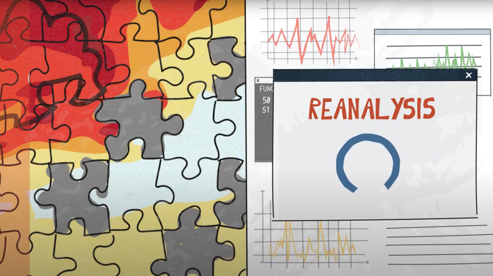
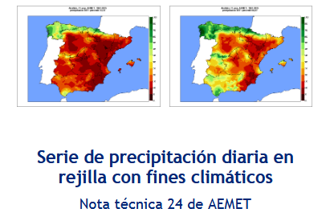

```{=html}
<div style="max-width:1100px;margin:6rem auto;padding:0 1.5rem;">

  <h2 style="color:#003087;font-size:1.5rem;font-weight:700;margin-bottom:0.8rem;">Datos utilizados</h2>
  <p style="color:#4a5568;line-height:1.6;margin-bottom:2rem;">
    Se han utilizado tres fuentes de datos en el proyecto:
    modelos globales de predicción estacional de <em>Copernicus Climate Service (C3S)</em>, el reanálisis
    atmosférico ERA5 de ECMWF como referencia observacional, y la base
    de precipitación diaria observada ROCIO_IBEB de AEMET.
  </p>

  <!-- ============================================================ -->
  <!-- 3 CARDS DE ATERRIZAJE — ENLACES EXTERNOS                      -->
  <!-- ============================================================ -->
  <div class="datos-cards">

    <a class="datos-card"
       href="https://cds.climate.copernicus.eu/datasets/seasonal-monthly-single-levels?tab=overview"
       target="_blank" rel="noopener">
      <div class="datos-card-head">
        <h3>Modelos Estacional Copernicus</h3>
        <span class="datos-card-ext">Abrir en Copernicus CDS ↗</span>
      </div>
      <div class="datos-card-img datos-card-img-copernicus">
        
      </div>
    </a>

    <a class="datos-card"
       href="https://cds.climate.copernicus.eu/datasets/reanalysis-era5-single-levels?tab=overview"
       target="_blank" rel="noopener">
      <div class="datos-card-head">
        <h3>ERA5</h3>
        <span class="datos-card-ext">Abrir en Copernicus CDS ↗</span>
      </div>
      <div class="datos-card-img datos-card-img-era5">
        
      </div>
    </a>

    <a class="datos-card"
       href="https://www.aemet.es/gl/serviciosclimaticos/cambio_climat/datos_diarios?w=1"
       target="_blank" rel="noopener">
      <div class="datos-card-head">
        <h3>ROCIO_IBEB</h3>
        <span class="datos-card-ext">Abrir en AEMET ↗</span>
      </div>
      <div class="datos-card-img datos-card-img-rocio">
        
      </div>
    </a>

  </div>

  <!-- ════════════════════════════════════════════════════════════ -->
  <!-- SECCIÓN COPERNICUS                                            -->
  <!-- ════════════════════════════════════════════════════════════ -->
  <section id="copernicus" class="datos-section">

    <h3 class="datos-section-title">Modelos Estacional Copernicus</h3>
    <p style="font-size:0.95rem;line-height:1.7;color:#1a2332;margin-bottom:1.2rem;">
      Los datos de predicción estacional se obtienen del <a href="https://cds.climate.copernicus.eu/"
         target="_blank" rel="noopener"
         style="color:#0072bc;font-weight:600;">Copernicus Climate Data Store</a>
      a través de la
      <a href="https://confluence.ecmwf.int/display/COPSRV/CDS+web+API+%28cdsapi%29+training"
         target="_blank" rel="noopener"
         style="color:#0072bc;font-weight:600;">API oficial de Copernicus</a>.
      Los modelos empleados son:
    </p>

    <!-- ── Modelos: 8 tarjetas en grid 4×2 (clickables → web oficial) ── -->
    <div class="datos-models-grid">

      <a class="model-card"
         href="https://charts.ecmwf.int/products/seasonal_system5_standard_rain?area=GLOB&base_time=202605010000&stats=tsum&valid_time=202606010000"
         target="_blank" rel="noopener">
        <h4>ECMWF-SEAS5.1</h4>
        <p>European Centre for Medium-Range Weather Forecasts</p>
        <span class="model-ext">Ver en ECMWF ↗</span>
      </a>

      <a class="model-card"
         href="https://kunden.dwd.de/climatepredictions-basic/app.htm?category=subseasonal&language=en&display=map"
         target="_blank" rel="noopener">
        <h4>DWD-GCFS2.2</h4>
        <p>Deutscher Wetterdienst · Servicio Meteorológico Alemán</p>
        <span class="model-ext">Ver en DWD ↗</span>
      </a>

      <a class="model-card"
         href="https://sps.cmcc.it/"
         target="_blank" rel="noopener">
        <h4>CMCC-SPSv4</h4>
        <p>Centro Euro-Mediterraneo sui Cambiamenti Climatici · Italia</p>
        <span class="model-ext">Ver en CMCC ↗</span>
      </a>

      <a class="model-card"
         href="https://seasonal.meteo.fr/"
         target="_blank" rel="noopener">
        <h4>METEOFrance-S9</h4>
        <p>Servicio Meteorológico Francés</p>
        <span class="model-ext">Ver en Météo-France ↗</span>
      </a>

      <a class="model-card"
         href="https://climate-scenarios.canada.ca/?page=seasonal-forecasts"
         target="_blank" rel="noopener">
        <h4>ECCC-GNEMO5</h4>
        <p>Environment and Climate Change Canada</p>
        <span class="model-ext">Ver en ECCC ↗</span>
      </a>

      <a class="model-card"
         href="https://www.cpc.ncep.noaa.gov/products/CFSv2/CFSv2seasonal.shtml"
         target="_blank" rel="noopener">
        <h4>NCEP-CFSv2</h4>
        <p>National Centers for Environmental Prediction · NOAA, EE.UU.</p>
        <span class="model-ext">Ver en NCEP/NOAA ↗</span>
      </a>

      <a class="model-card"
         href="https://www.metoffice.gov.uk/research/climate/seasonal-to-decadal/gpc-outlooks"
         target="_blank" rel="noopener">
        <h4>UKMO-GLOSEA610</h4>
        <p>UK Met Office · Servicio Meteorológico Británico</p>
        <span class="model-ext">Ver en UKMO ↗</span>
      </a>

      <a class="model-card"
         href="https://www.jma.go.jp/bosai/map.html#5/34.5/137/&elem=temperature&pattern=P1M&term=0&contents=season&lang=en"
         target="_blank" rel="noopener">
        <h4>JMA-CPS4</h4>
        <p>Servicio Meteorológico Japonés</p>
        <span class="model-ext">Ver en JMA ↗</span>
      </a>

    </div>

    <h4 class="datos-subtitle">Variables descargadas</h4>
    <div class="grid-2" style="margin:1rem 0 1.5rem;">
      <div class="info-tile">
        <h3>Presión al nivel del mar (MSL)</h3>
        <p>Utilizada para el cálculo de componentes del viento geostrófico superficial (ug, vg) a partir
        de MSL y T1000. Base de los análogos sinópticos y los modos de variabilidad EOF/PLS.</p>
      </div>
      <div class="info-tile">
        <h3>Altura geopotencial 500 hPa (Z500)</h3>
        <p>Componentes del viento a 500 hPa (u500, v500). Empleada tanto en la
        caracterización de la circulación Euro-Atlántica.</p>
      </div>
      <div class="info-tile">
        <h3>Temperatura a 2 m (T2M)</h3>
        <p>Variable predictanda usada en dowsncaling y weighting.</p>
      </div>
      <div class="info-tile">
        <h3>Precipitación total (TP)</h3>
        <p>Variable predictanda principal. Usada en todas las metodologías.</p>
      </div>
    </div>

  </section>

  <!-- ════════════════════════════════════════════════════════════ -->
  <!-- SECCIÓN ERA5                                                  -->
  <!-- ════════════════════════════════════════════════════════════ -->
  <section id="era5" class="datos-section">

    <h3 class="datos-section-title">Reanálisis ERA5</h3>
    <p style="font-size:0.95rem;line-height:1.7;color:#1a2332;margin-bottom:1.2rem;">
      El reanálisis
      <a href="https://confluence.ecmwf.int/display/CKB/The+family+of+ERA5+datasets"
         target="_blank" rel="noopener"
         style="color:#0072bc;font-weight:600;">ERA5 de ECMWF</a> se emplea como referencia observacional
      para la fase de calibración del downscaling y para la estimación de los modos de
      variabilidad atmosférica. ERA5 cubre el periodo desde 1940 hasta la actualidad con resolución horaria y mensual.
    </p>

    <h4 class="datos-subtitle">Variables descargadas</h4>
    <div class="grid-2" style="margin:1rem 0 1.5rem;">
      <div class="info-tile">
        <h3>Presión al nivel del mar (MSL)</h3>
        <p>Junto con T1000, base para el cálculo del viento geostrófico superficial usado en los análogos
        del downscaling y en los modos EOF/PLS de circulación Euro-Atlántica.</p>
      </div>
      <div class="info-tile">
        <h3>Altura geopotencial 500 hPa (Z500)</h3>
        <p>Componentes del viento a 500 hPa (u500, v500). Caracteriza la circulación de niveles medios y
        complementa la información de superficie en la clasificación sinóptica.</p>
      </div>
      <div class="info-tile">
        <h3>Temperatura a 2 m (T2M)</h3>
        <p>Observación de referencia para validar y calibrar las predicciones estacionales.</p>
      </div>
      <div class="info-tile">
        <h3>Precipitación total (TP)</h3>
        <p>Observación de referencia para validar y calibrar las predicciones estacionales.</p>
      </div>
    </div>

  </section>

  <!-- ════════════════════════════════════════════════════════════ -->
  <!-- SECCIÓN ROCIO_IBEB                                            -->
  <!-- ════════════════════════════════════════════════════════════ -->
  <section id="rocio-ibeb" class="datos-section">

    <h3 class="datos-section-title">ROCIO_IBEB · Precipitación diaria observada</h3>
    <p style="font-size:0.95rem;line-height:1.7;color:#1a2332;margin-bottom:1rem;">
      <a href="https://www.aemet.es/gl/serviciosclimaticos/cambio_climat/datos_diarios?w=1"
         target="_blank" rel="noopener"
         style="color:#0072bc;font-weight:600;">ROCIO_IBEB</a> es la red observacional de precipitación diaria,
      desarrollada por AEMET. Constituye la base observacional sobre la que se asocia cada situación
      sinóptica de referencia con su patrón de precipitación correspondiente en el algoritmo de
      análogos del downscaling.
    </p>
    <p style="font-size:0.95rem;line-height:1.7;color:#1a2332;margin-bottom:1.2rem;">
      Los datos se proyectan sobre la malla de 5×5 km que cubre la Península
      Ibérica e Islas Baleares (20.945 celdas), permitiendo así la verificación celda a celda
      de las predicciones del downscaling estadístico.
    </p>

  </section> 

</div>


<!-- ============================================================ -->
<!-- ESTILOS                                                       -->
<!-- ============================================================ -->
<style>
/* ── 3 cards estilo AEMET (clickables) ───────────────────── */
.datos-cards {
  display: grid;
  grid-template-columns: repeat(3, 1fr);
  gap: 1.2rem;
  margin-bottom: 3rem;
}

.datos-card {
  display: flex;
  flex-direction: column;
  background: white;
  border-radius: 0;
  overflow: hidden;
  text-decoration: none;
  color: inherit;
  box-shadow: 0 2px 10px rgba(0,48,135,0.08);
  transition: transform 0.2s, box-shadow 0.2s;
}
.datos-card:hover {
  transform: translateY(-3px);
  box-shadow: 0 8px 22px rgba(0,48,135,0.2);
  text-decoration: none;
  color: inherit;
}

.datos-card-head {
  background: #003087;
  color: white;
  padding: 1.1rem 1.3rem;
  min-height: 115px;
  display: flex;
  flex-direction: column;
  justify-content: center;
}
.datos-card-head h3 {
  color: white;
  font-size: 1.05rem;
  font-weight: 700;
  margin: 0 0 0.3rem 0;
  line-height: 1.25;
}
.datos-card-head p {
  color: rgba(255,255,255,0.85);
  font-size: 0.82rem;
  margin: 0;
  line-height: 1.4;
}
.datos-card-ext {
  display: inline-block;
  margin-top: 0.5rem;
  font-size: 0.72rem;
  font-weight: 600;
  color: #b8d4f0;
  letter-spacing: 0.05em;
  text-transform: uppercase;
}
.datos-card:hover .datos-card-ext {
  color: white;
}

.datos-card-img {
  height: 180px;
  display: flex;
  align-items: center;
  justify-content: center;
  overflow: hidden;
  position: relative;
}

/* Copernicus: fondo blanco para que encaje con el logo */
.datos-card-img-copernicus {
  background: white;
  padding: 1.2rem;
}
.datos-card-img-copernicus img {
  max-height: 100%;
  max-width: 100%;
  object-fit: contain;
}

/* ERA5: imagen tipo collage, cubre todo */
.datos-card-img-era5 {
  background: linear-gradient(135deg, #f8fafc 0%, #e8eef5 100%);
}
.datos-card-img-era5 img {
  width: 100%;
  height: 100%;
  object-fit: cover;
}

/* ROCIO: foto de la nota técnica */
.datos-card-img-rocio {
  background: #e8f4fc;
}
.datos-card-img-rocio img {
  width: 100%;
  height: 100%;
  object-fit: contain;
  padding: 0.5rem;
}

/* ── Grid de modelos (clickables → web oficial) ─────────── */
.datos-models-grid {
  display: grid;
  grid-template-columns: repeat(4, 1fr);
  gap: 1rem;
  margin: 1.2rem 0 2rem;
}

.model-card {
  display: flex;
  flex-direction: column;
  background: white;
  border: 1px solid #dde3ed;
  border-radius: 10px;
  padding: 1.2rem 1.1rem;
  text-align: center;
  text-decoration: none;
  color: inherit;
  box-shadow: 0 2px 8px rgba(0,48,135,0.05);
  transition: transform 0.2s, box-shadow 0.2s, border-color 0.2s;
  position: relative;
}
.model-card:hover {
  transform: translateY(-3px);
  box-shadow: 0 8px 22px rgba(0,48,135,0.15);
  border-color: #0072bc;
  text-decoration: none;
  color: inherit;
}
.model-card .model-system {
  display: inline-block;
  align-self: center;
  font-size: 0.65rem;
  font-weight: 700;
  letter-spacing: 0.1em;
  text-transform: uppercase;
  color: #0072bc;
  background: #e8f4fc;
  border-radius: 99px;
  padding: 3px 10px;
  margin-bottom: 0.5rem;
}
.model-card h4 {
  font-size: 1.05rem;
  font-weight: 700;
  color: #003087;
  margin: 0 0 0.4rem 0;
  letter-spacing: 0.02em;
}
.model-card p {
  font-size: 0.8rem;
  color: #4a5568;
  line-height: 1.4;
  margin: 0 0 0.8rem 0;
  flex-grow: 1;
}
.model-card .model-ext {
  display: block;
  margin-top: auto;
  font-size: 0.7rem;
  font-weight: 600;
  letter-spacing: 0.05em;
  text-transform: uppercase;
  color: #8892a4;
  transition: color 0.15s;
}
.model-card:hover .model-ext {
  color: #003087;
}

/* ── Info tiles (NO INTERACTIVAS) ─────────────────────────── */
.info-tile {
  background: white;
  border: 1px solid #dde3ed;
  border-radius: 10px;
  padding: 1.2rem 1.3rem;
  /* sin transition, sin hover */
}
.info-tile h3 {
  font-size: 0.95rem;
  font-weight: 700;
  color: #003087;
  margin-bottom: 0.5rem;
  letter-spacing: 0.02em;
}
.info-tile p {
  font-size: 0.85rem;
  color: #4a5568;
  line-height: 1.6;
  margin: 0;
}

/* ── Secciones expandidas ───────────────────────────────── */
.datos-section {
  padding-top: 1.5rem;
  margin-top: 2rem;
  border-top: 2px solid #e8eef5;
  scroll-margin-top: 130px;
}
.datos-section:first-of-type {
  border-top: none;
  margin-top: 0;
}

.datos-section-title {
  color: #003087;
  font-size: 1.25rem;
  font-weight: 700;
  margin: 0 0 0.9rem 0;
  padding-bottom: 0.6rem;
  border-bottom: 3px solid #0072bc;
  display: inline-block;
}

.datos-subtitle {
  color: #003087;
  font-size: 1rem;
  font-weight: 700;
  margin: 1.5rem 0 0.6rem 0;
  letter-spacing: 0.02em;
}

/* ── Responsive ─────────────────────────────────────────── */
@media (max-width: 900px) {
  .datos-cards { grid-template-columns: 1fr; }
  .datos-models-grid { grid-template-columns: repeat(2, 1fr); }
  .datos-card-img { height: 180px; }
}
@media (max-width: 540px) {
  .datos-models-grid { grid-template-columns: 1fr; }
}
</style>
```
