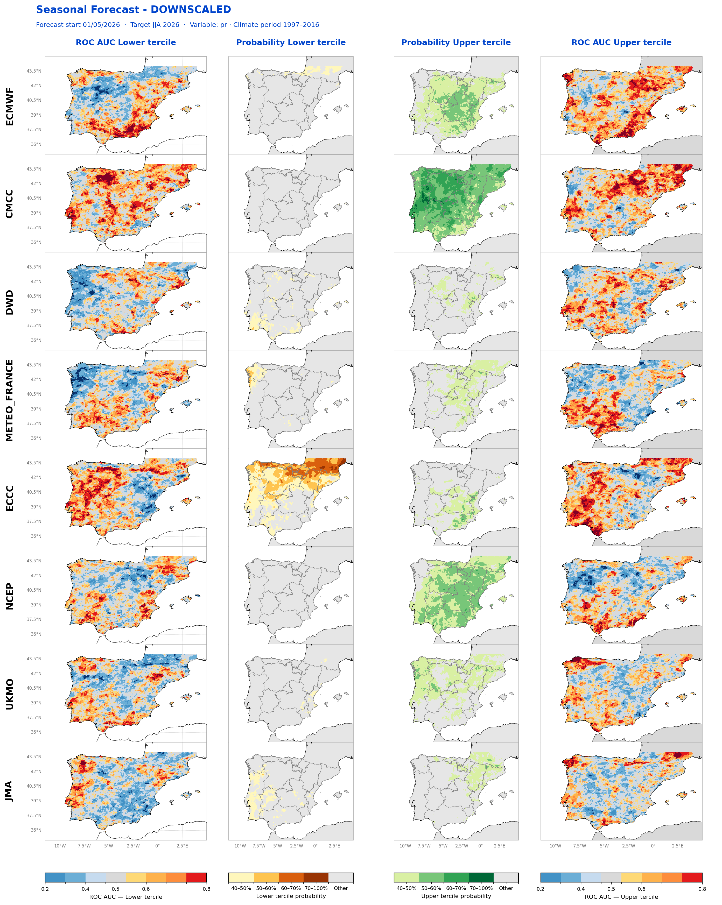

```{=html}

<div style="max-width:960px;margin:6rem auto;padding:0 1.5rem;">


  <h2 style="color:#003087;font-size:1.5rem;font-weight:700;margin-bottom:0.5rem;">Verificación Downscaling</h2>
  <p style="color:#4a5568;margin-bottom:1.5rem;">
    Resultados del downscaling estadístico de precipitación. Selecciona el modelo y el tipo de gráfico para comparar:

    <a href="downscaling-metodologia.html" style="color:#0072bc;font-weight:600;">¿Cómo se calcula? Ver metodología →</a>
  </p>

  <!-- ============================================================ -->
  <!-- CABECERA: VARIABLE + PERIODO PREDICCIÓN                      -->
  <!-- ============================================================ -->
 <div class="ds-header-card">
  <div class="ds-header-block">
    <span class="ds-header-tag">Variable</span>
    <span class="ds-header-value" id="ds-var-display">Precipitación</span>
  </div>
  <div class="ds-header-sep"></div>
  <div class="ds-header-block">
    <span class="ds-header-tag">Periodo Predicción</span>
    <span class="ds-header-value" id="ds-init-display">JJA 2026</span>
    <span class="ds-header-sub" id="ds-period-display">Inicialización · Mayo 2026</span>
  </div>
</div>

  <!-- ============================================================ -->
  <!-- VISOR INTERACTIVO                                            -->
  <!-- ============================================================ -->
  <div class="ds-viewer">

    <!-- Selectores -->
    <div class="ds-controls">
      <div class="ds-control-group">
        <label class="ds-label">Modelo</label>
        <div class="ds-button-row" id="ds-models"></div>
      </div>
      <div class="ds-control-group">
        <label class="ds-label">Tipo de gráfico</label>
        <div class="ds-button-row" id="ds-graphs"></div>
      </div>
    </div>

    <!-- Imagen activa -->
    <div class="ds-image-wrap">
      <button class="ds-nav ds-nav-prev" id="ds-prev" aria-label="Anterior">‹</button>
      <div class="ds-image-inner">
        
        <div class="ds-caption" id="ds-caption"></div>
      </div>
      <button class="ds-nav ds-nav-next" id="ds-next" aria-label="Siguiente">›</button>
    </div>

    <!-- Acciones -->
    <div class="ds-actions">
      <button class="ds-action-btn" id="ds-zoom">⤢ Ampliar</button>
      <a class="ds-action-btn ds-action-primary" id="ds-download" download>↓ Descargar imagen</a>
    </div>
  </div>

  <!-- ============================================================ -->
  <!-- SECCIÓN COMPARACIÓN                                          -->
  <!-- ============================================================ -->
  <h3 style="color:#003087;margin-top:3rem;margin-bottom:0.5rem;">Comparación entre modelos</h3>
  <p style="font-size:0.9rem;color:#4a5568;margin-bottom:1.5rem;">
    
  </p>

  <div class="ds-gallery">

    <figure class="ds-gallery-item">
      
      <figcaption>
        <strong>Comparación por modelo</strong>
        <span>Vista comparativa de cada modelo del downscaling lado a lado.</span>
        <a href="images/downscaling/9-perModel_DOWN_pr_3m.png"
           download class="ds-gallery-dl">↓ Descargar</a>
      </figcaption>
    </figure>

  </div>

</div>


<!-- ============================================================ -->
<!-- ESTILOS                                                       -->
<!-- ============================================================ -->
<style>
/* ── Cabecera variable + periodo ─────────────────────────── */
.ds-header-card {
  display: flex;
  align-items: stretch;
  background: linear-gradient(135deg, #003087 0%, #0072bc 100%);
  border-radius: 10px;
  padding: 1.4rem 2rem;
  margin-bottom: 1.5rem;
  box-shadow: 0 4px 16px rgba(0,48,135,0.15);
  color: white;
  flex-wrap: wrap;
  gap: 1rem;
}
.ds-header-block {
  display: flex;
  flex-direction: column;
  justify-content: center;
  flex: 1;
  min-width: 200px;
}
.ds-header-tag {
  font-size: 0.7rem;
  font-weight: 700;
  letter-spacing: 0.14em;
  text-transform: uppercase;
  color: rgba(255,255,255,0.7);
  margin-bottom: 0.3rem;
}
.ds-header-value {
  font-size: 2rem;
  font-weight: 800;
  line-height: 1.1;
  color: white;
}
.ds-header-sub {
  font-size: 0.78rem;
  color: rgba(255,255,255,0.75);
  margin-top: 0.2rem;
  font-weight: 500;
}
.ds-header-sep {
  width: 1px;
  background: rgba(255,255,255,0.2);
}

/* ── Visor ─────────────────────────────────────────────── */
.ds-viewer {
  background: white;
  border: 1px solid #dde3ed;
  border-radius: 10px;
  padding: 1.5rem;
  box-shadow: 0 2px 12px rgba(0,48,135,0.06);
}

.ds-controls {
  display: flex;
  flex-direction: column;
  gap: 1rem;
  margin-bottom: 1.5rem;
}

.ds-control-group {
  display: flex;
  flex-direction: column;
  gap: 0.5rem;
}

.ds-label {
  font-size: 0.7rem;
  font-weight: 700;
  letter-spacing: 0.1em;
  text-transform: uppercase;
  color: #003087;
}

.ds-button-row {
  display: flex;
  flex-wrap: wrap;
  gap: 0.4rem;
}

.ds-btn {
  padding: 0.55rem 1rem;
  border: 1px solid #dde3ed;
  background: white;
  color: #4a5568;
  border-radius: 6px;
  font-family: inherit;
  font-size: 0.82rem;
  font-weight: 500;
  cursor: pointer;
  transition: all 0.15s;
  white-space: nowrap;
}
.ds-btn:hover {
  border-color: #0072bc;
  color: #003087;
}
.ds-btn.active {
  background: #003087;
  border-color: #003087;
  color: white;
  font-weight: 600;
}

/* ── Imagen visor ───────────────────────────────────────── */
.ds-image-wrap {
  display: flex;
  align-items: center;
  gap: 0.8rem;
  background: #f8fafc;
  border-radius: 8px;
  padding: 1rem;
  position: relative;
}

.ds-image-inner {
  flex: 1;
  text-align: center;
  min-width: 0;
}

.ds-image {
  max-width: 100%;
  max-height: 520px;
  height: auto;
  border-radius: 6px;
  cursor: zoom-in;
  box-shadow: 0 2px 10px rgba(0,0,0,0.08);
  display: inline-block;
  transition: opacity 0.25s;
}

.ds-image.loading { opacity: 0.4; }

.ds-caption {
  font-size: 0.78rem;
  color: #4a5568;
  margin-top: 0.7rem;
  font-style: italic;
}

.ds-nav {
  width: 38px;
  height: 38px;
  border-radius: 50%;
  border: 1px solid #dde3ed;
  background: white;
  color: #003087;
  font-size: 1.3rem;
  font-weight: 700;
  cursor: pointer;
  flex-shrink: 0;
  box-shadow: 0 2px 6px rgba(0,0,0,0.08);
  transition: all 0.15s;
  line-height: 1;
}
.ds-nav:hover {
  background: #003087;
  color: white;
  border-color: #003087;
}

/* ── Acciones ───────────────────────────────────────────── */
.ds-actions {
  display: flex;
  gap: 0.6rem;
  justify-content: center;
  margin-top: 1.2rem;
  flex-wrap: wrap;
}
.ds-action-btn {
  padding: 0.55rem 1.2rem;
  background: white;
  border: 1px solid #dde3ed;
  color: #003087;
  border-radius: 6px;
  font-family: inherit;
  font-size: 0.82rem;
  font-weight: 600;
  cursor: pointer;
  text-decoration: none;
  display: inline-flex;
  align-items: center;
  gap: 0.4rem;
  transition: all 0.15s;
}
.ds-action-btn:hover {
  background: #e8f4fc;
  border-color: #0072bc;
}
.ds-action-primary {
  background: #003087;
  color: white;
  border-color: #003087;
}
.ds-action-primary:hover {
  background: #0072bc;
  color: white;
  border-color: #0072bc;
}

/* ── Galería de comparación ─────────────────────────────── */
.ds-gallery {
  display: flex;
  flex-direction: column;
  gap: 1.5rem;
}
.ds-gallery-item {
  background: white;
  border: 1px solid #dde3ed;
  border-radius: 10px;
  overflow: hidden;
  margin: 0;
  box-shadow: 0 2px 8px rgba(0,48,135,0.05);
  transition: box-shadow 0.2s;
}
.ds-gallery-item:hover {
  box-shadow: 0 4px 16px rgba(0,48,135,0.1);
}
.ds-gallery-img {
  width: 100%;
  height: auto;
  display: block;
  cursor: zoom-in;
  background: #f8fafc;
  transition: opacity 0.2s;
}
.ds-gallery-img:hover {
  opacity: 0.93;
}
.ds-gallery-item figcaption {
  padding: 1rem 1.2rem;
  border-top: 1px solid #f0f4f8;
  display: flex;
  flex-direction: column;
  gap: 0.3rem;
  position: relative;
}
.ds-gallery-item figcaption strong {
  color: #003087;
  font-size: 0.95rem;
}
.ds-gallery-item figcaption span {
  font-size: 0.82rem;
  color: #4a5568;
}
.ds-gallery-dl {
  position: absolute;
  right: 1.2rem;
  top: 50%;
  transform: translateY(-50%);
  padding: 0.45rem 0.9rem;
  background: white;
  border: 1px solid #dde3ed;
  color: #003087;
  border-radius: 6px;
  font-size: 0.78rem;
  font-weight: 600;
  text-decoration: none;
  transition: all 0.15s;
  white-space: nowrap;
}
.ds-gallery-dl:hover {
  background: #003087;
  color: white;
  border-color: #003087;
}

/* ── Lightbox ───────────────────────────────────────────── */
#ds-lightbox {
  display: none;
  position: fixed;
  inset: 0;
  background: rgba(0,0,0,0.55);
  z-index: 9999;
  flex-direction: column;
  align-items: center;
  justify-content: center;
  backdrop-filter: blur(4px);
  padding: 1rem;
}
#ds-lightbox.open { display: flex; }
#ds-lightbox img {
  max-width: 85vw;
  max-height: 80vh;
  border-radius: 10px;
  box-shadow: 0 20px 60px rgba(0,0,0,0.4);
  background: white;
}
.ds-lightbox-actions {
  display: flex;
  gap: 1rem;
  margin-top: 1rem;
}

/* ── Responsive ─────────────────────────────────────────── */
@media (max-width: 768px) {
  .ds-header-card { padding: 1.2rem 1.4rem; }
  .ds-header-value { font-size: 1.5rem; }
  .ds-header-sep { display: none; }
  .ds-image-wrap { padding: 0.6rem; gap: 0.3rem; }
  .ds-nav { width: 32px; height: 32px; font-size: 1.1rem; }
  .ds-image { max-height: 380px; }
  .ds-gallery-dl {
    position: static;
    transform: none;
    align-self: flex-start;
    margin-top: 0.5rem;
  }
}
</style>


<!-- ============================================================ -->
<!-- LIGHTBOX                                                      -->
<!-- ============================================================ -->
<div id="ds-lightbox">
  
  <div class="ds-lightbox-actions">
    <a id="ds-lightbox-dl" class="ds-action-btn ds-action-primary" download>↓ Descargar</a>
    <button class="ds-action-btn" onclick="document.getElementById('ds-lightbox').classList.remove('open');document.body.style.overflow='';">✕ Cerrar</button>
  </div>
</div>


<!-- ============================================================ -->
<!-- LÓGICA                                                        -->
<!-- ============================================================ -->
<script>
(function() {

  // ════════════════════════════════════════════════════════════
  //  CONFIGURACIÓN — editar cada mes
  // ════════════════════════════════════════════════════════════
  const VARIABLE       = 'Precipitación';
  const INICIALIZACION = 'Mayo 2026';
  const PERIODO_VALIDO = 'JJA 2026';
  // ════════════════════════════════════════════════════════════

  // Modelos disponibles (id = slug del nombre de archivo · label = visible)
  const MODELS = [
    { id: 'ecmwf',         label: 'ECMWF-SEAS5.1' },
    { id: 'dwd',           label: 'DWD' },
    { id: 'cmcc',          label: 'CMCC' },
    { id: 'meteo_france',  label: 'Météo-France' },
    { id: 'ukmo',          label: 'UKMO' },
    { id: 'ncep',          label: 'NCEP' },
    { id: 'eccc',          label: 'ECCC' },
    { id: 'jma',           label: 'JMA' },
  ];

  // Tipos de gráfico (prefix = patrón en el nombre del fichero)
  const GRAPHS = [
    { id: 'terciles', label: 'Probabilidad por terciles', prefix: '3_terciles_',      caption: 'Probabilidad por terciles' },
    { id: 'corr',     label: 'Correlación de Spearman',   prefix: '4_corr-spearman_', caption: 'Correlación de Spearman' },
    { id: 'roc',      label: 'Curvas ROC',                prefix: '5_roc_3_pr_',      caption: 'Curvas ROC · Precipitación' },
    { id: 'rps',      label: 'Ranked Probability Score',  prefix: '6_rps_pr_',        caption: 'Ranked Probability Score (RPS)' },
    { id: 'bs',       label: 'Brier Score',               prefix: '7_bs_3_pr_',       caption: 'Brier Score' },
  ];

  // Estado
  let currentModel = MODELS[0].id;
  let currentGraph = GRAPHS[0].id;

  // Pintar cabecera
  document.getElementById('ds-var-display').textContent    = VARIABLE;
  document.getElementById('ds-init-display').textContent   = PERIODO_VALIDO;
  document.getElementById('ds-period-display').textContent = 'Inicialización · ' + INICIALIZACION;

  // Construir botones
  function buildButtons(containerId, items, getCurrent, setCurrent) {
    const c = document.getElementById(containerId);
    c.innerHTML = '';
    items.forEach(it => {
      const b = document.createElement('button');
      b.className = 'ds-btn' + (getCurrent() === it.id ? ' active' : '');
      b.textContent = it.label;
      b.dataset.id = it.id;
      b.addEventListener('click', () => {
        setCurrent(it.id);
        c.querySelectorAll('.ds-btn').forEach(x => x.classList.toggle('active', x.dataset.id === it.id));
        updateImage();
      });
      c.appendChild(b);
    });
  }

  function updateImage() {
    const graph = GRAPHS.find(g => g.id === currentGraph);
    const model = MODELS.find(m => m.id === currentModel);
    const path  = `images/downscaling/${graph.prefix}${model.id}.png`;

    const img = document.getElementById('ds-image');
    img.classList.add('loading');
    img.onload  = () => img.classList.remove('loading');
    img.onerror = () => {
      img.classList.remove('loading');
      img.alt = 'Imagen no disponible: ' + path;
    };
    img.src = path;
    img.alt = `${graph.label} · ${model.label} · ${PERIODO_VALIDO}`;

    document.getElementById('ds-caption').textContent =
      `${graph.caption} · ${model.label} · ${PERIODO_VALIDO}`;

    const dl = document.getElementById('ds-download');
    dl.href     = path;
    dl.download = `${graph.id}_${model.id}.png`;
  }

  // Navegación con flechas: avanza entre modelos manteniendo el gráfico
  function shift(delta) {
    const idx = MODELS.findIndex(m => m.id === currentModel);
    const next = (idx + delta + MODELS.length) % MODELS.length;
    currentModel = MODELS[next].id;
    document.querySelectorAll('#ds-models .ds-btn').forEach(b =>
      b.classList.toggle('active', b.dataset.id === currentModel)
    );
    updateImage();
  }

  // ── Lightbox ──
  function openLightboxFor(src, downloadName) {
    const lb = document.getElementById('ds-lightbox');
    document.getElementById('ds-lightbox-img').src = src;
    const dl = document.getElementById('ds-lightbox-dl');
    dl.href = src;
    dl.download = downloadName || src.split('/').pop();
    lb.classList.add('open');
    document.body.style.overflow = 'hidden';
  }
  function openLightboxFromViewer() {
    const img = document.getElementById('ds-image');
    openLightboxFor(img.src, document.getElementById('ds-download').download);
  }
  function closeLightbox() {
    document.getElementById('ds-lightbox').classList.remove('open');
    document.body.style.overflow = '';
  }

  // Inicialización
  document.addEventListener('DOMContentLoaded', () => {
    buildButtons('ds-models', MODELS, () => currentModel, id => currentModel = id);
    buildButtons('ds-graphs', GRAPHS, () => currentGraph, id => currentGraph = id);
    updateImage();

    document.getElementById('ds-prev').addEventListener('click', () => shift(-1));
    document.getElementById('ds-next').addEventListener('click', () => shift(+1));
    document.getElementById('ds-image').addEventListener('click', openLightboxFromViewer);
    document.getElementById('ds-zoom').addEventListener('click', openLightboxFromViewer);

    // Galería: click en imagen abre lightbox
    document.querySelectorAll('.ds-gallery-img').forEach(img => {
      img.addEventListener('click', () => openLightboxFor(img.src, img.src.split('/').pop()));
    });

    document.getElementById('ds-lightbox').addEventListener('click', e => {
      if (e.target.id === 'ds-lightbox') closeLightbox();
    });
    document.addEventListener('keydown', e => {
      if (e.key === 'Escape') closeLightbox();
      // Las flechas solo cambian de modelo si el lightbox está cerrado
      if (!document.getElementById('ds-lightbox').classList.contains('open')) {
        if (e.key === 'ArrowLeft')  shift(-1);
        if (e.key === 'ArrowRight') shift(+1);
      }
    });
  });

})();
</script>
```
