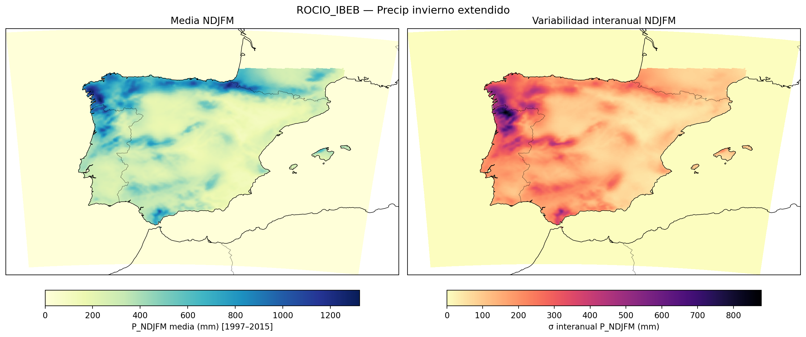
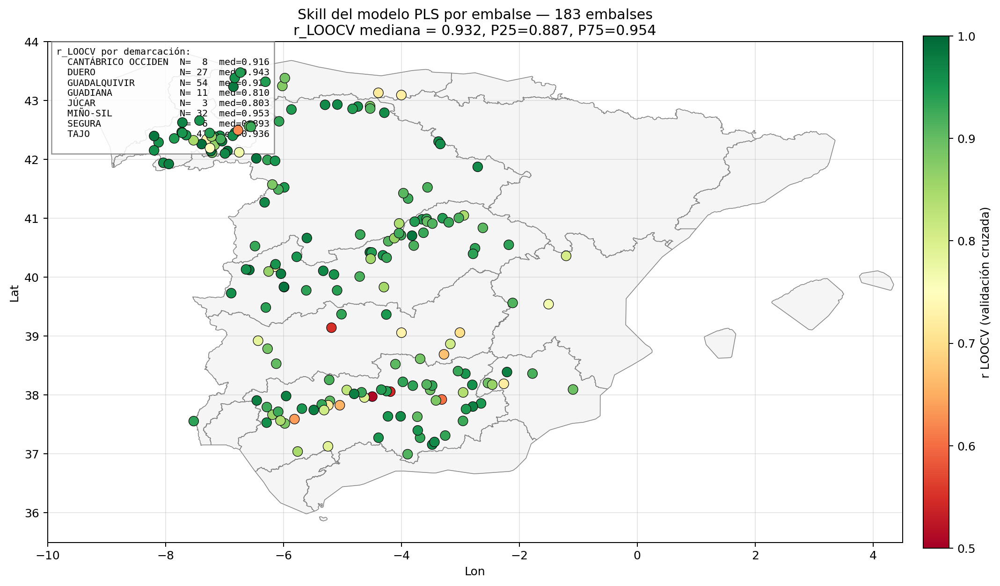

```{=html}
<style>
/* ─── Estilo general página Acerca de ─── */
.acerca-wrap {
  max-width: 1000px;
  margin: 0 auto;
  padding: 1rem 1.5rem 4rem;
  font-family: 'IBM Plex Sans', system-ui, sans-serif;
  color: #1f2937;
  line-height: 1.65;
  text-align: justify;
  text-justify: inter-word;
  hyphens: auto;
  -webkit-hyphens: auto;
}

/* Excepciones: elementos que NO deben justificarse */
.acerca-wrap h2,
.acerca-wrap h3,
.acerca-wrap h4,
.acerca-wrap figcaption,
.acerca-wrap .formula-caption,
.acerca-wrap .met-rango,
.acerca-wrap .sigma-lab,
.acerca-wrap .callout-title {
  text-align: left;
}
.acerca-wrap h2 {
  color: #003087;
  border-bottom: 2px solid #0072bc;
  padding-bottom: 0.4rem;
  margin-top: 2.5rem;
  font-size: 1.55rem;
  font-weight: 600;
  letter-spacing: -0.01em;
}
.acerca-wrap h3 {
  color: #0072bc;
  margin-top: 1.8rem;
  font-size: 1.18rem;
  font-weight: 600;
}
.acerca-wrap h4 {
  color: #1f2937;
  margin-top: 1.3rem;
  font-size: 1.02rem;
  font-weight: 600;
}
.acerca-wrap p { margin: 0.7rem 0; }
.acerca-wrap ul { margin: 0.5rem 0 0.9rem 0; padding-left: 1.4rem; }
.acerca-wrap li { margin: 0.25rem 0; }

.acerca-resumen {
  background: linear-gradient(135deg, #f0f5fa 0%, #e6eef7 100%);
  border-left: 4px solid #0072bc;
  padding: 1.2rem 1.5rem;
  border-radius: 4px;
  margin: 1.5rem 0 2.5rem;
}
.acerca-resumen p { margin: 0.4rem 0; }
.acerca-resumen strong { color: #003087; }

.acerca-callout {
  background: #fff8e1;
  border-left: 4px solid #f9a825;
  padding: 0.9rem 1.2rem;
  border-radius: 4px;
  margin: 1.2rem 0;
  font-size: 0.95rem;
}
.acerca-callout.info {
  background: #e8f4fd;
  border-left-color: #0072bc;
}
.acerca-callout.success {
  background: #e8f5e9;
  border-left-color: #2e7d32;
}
.acerca-callout .callout-title {
  font-weight: 600;
  color: #003087;
  display: block;
  margin-bottom: 0.3rem;
}

.tabla-comp {
  width: 100%;
  border-collapse: collapse;
  margin: 1.2rem 0;
  font-size: 0.92rem;
  box-shadow: 0 1px 3px rgba(0,0,0,0.06);
}
.tabla-comp th,
.tabla-comp td {
  padding: 0.7rem 0.9rem;
  text-align: left;
  border-bottom: 1px solid #e5e9f0;
  vertical-align: top;
}
.tabla-comp thead th {
  background: #003087;
  color: white;
  font-weight: 500;
  letter-spacing: 0.02em;
  text-transform: uppercase;
  font-size: 0.82rem;
  border-bottom: none;
}
.tabla-comp tbody tr:nth-child(even) { background: #f7f9fc; }
.tabla-comp td:first-child {
  font-weight: 600;
  color: #003087;
  width: 28%;
}

.formula-box {
  background: #f7f9fc;
  border: 1px solid #dde3ed;
  border-radius: 4px;
  padding: 1rem 1.3rem;
  margin: 1rem 0;
  font-size: 1.02rem;
}
.formula-caption {
  font-size: 0.85rem;
  color: #6b7280;
  margin-top: 0.4rem;
  font-style: italic;
}

.metricas-grid {
  display: grid;
  grid-template-columns: repeat(auto-fit, minmax(280px, 1fr));
  gap: 1rem;
  margin: 1.2rem 0;
}
.metrica-card {
  background: white;
  border: 1px solid #dde3ed;
  border-top: 3px solid #0072bc;
  border-radius: 4px;
  padding: 1rem 1.2rem;
  box-shadow: 0 1px 3px rgba(0,0,0,0.04);
}
.metrica-card h4 {
  margin: 0 0 0.4rem 0 !important;
  color: #003087;
  font-size: 1rem;
}
.metrica-card .met-desc {
  font-size: 0.88rem;
  color: #4b5563;
  margin: 0.3rem 0;
}
.metrica-card .met-rango {
  font-size: 0.82rem;
  color: #6b7280;
  margin-top: 0.5rem;
  padding-top: 0.5rem;
  border-top: 1px dashed #e5e9f0;
}
.metrica-card .met-rango strong { color: #003087; }

.flujo-wrap {
  background: white;
  border: 1px solid #dde3ed;
  border-radius: 4px;
  padding: 1.5rem 1rem;
  margin: 1.5rem 0;
  overflow-x: auto;
}
.flujo-wrap svg { display: block; margin: 0 auto; max-width: 100%; height: auto; }

.sigma-grid {
  display: grid;
  grid-template-columns: repeat(auto-fit, minmax(260px, 1fr));
  gap: 0.8rem;
  margin: 1rem 0;
}
.sigma-item {
  background: #f7f9fc;
  border-left: 3px solid #0072bc;
  padding: 0.8rem 1rem;
  border-radius: 3px;
}
.sigma-item .sigma-val {
  font-family: 'IBM Plex Mono', monospace;
  font-size: 1.4rem;
  font-weight: 600;
  color: #003087;
}
.sigma-item .sigma-lab {
  font-size: 0.85rem;
  color: #4b5563;
  margin-top: 0.3rem;
}

.refs-list {
  font-size: 0.9rem;
  line-height: 1.7;
  background: #f7f9fc;
  border-radius: 4px;
  padding: 1rem 1.4rem;
  list-style-type: none;
  padding-left: 1.4rem;
}
.refs-list li {
  margin: 0.55rem 0;
  padding-left: 1rem;
  text-indent: -1rem;
}
.refs-list li::before {
  content: "▪ ";
  color: #0072bc;
  font-weight: bold;
}
.refs-list a { color: #0072bc; text-decoration: none; word-break: break-word; }
.refs-list a:hover { text-decoration: underline; }

.chip {
  display: inline-block;
  background: #e8f4fd;
  color: #003087;
  padding: 0.15rem 0.6rem;
  border-radius: 12px;
  font-size: 0.8rem;
  font-weight: 500;
  margin: 0 0.2rem;
}

.sclimware-card {
  background: linear-gradient(135deg, #003087 0%, #0072bc 100%);
  color: white;
  padding: 1.5rem 1.8rem;
  border-radius: 6px;
  margin: 1.5rem 0;
  box-shadow: 0 3px 10px rgba(0,48,135,0.15);
}
.sclimware-card h3 {
  color: white !important;
  margin-top: 0 !important;
  border-bottom: 1px solid rgba(255,255,255,0.3);
  padding-bottom: 0.5rem;
}
.sclimware-card p { color: rgba(255,255,255,0.92); }
.sclimware-card a {
  display: inline-block;
  margin-top: 0.8rem;
  background: white;
  color: #003087;
  padding: 0.5rem 1.1rem;
  border-radius: 4px;
  font-weight: 600;
  text-decoration: none;
  transition: transform 0.15s;
  font-size: 0.9rem;
}
.sclimware-card a:hover { transform: translateY(-1px); }

/* ─── Imágenes ilustrativas ─── */
.acerca-wrap figure {
  margin: 1.5rem 0 1.8rem;
  text-align: center;
}
.acerca-wrap figure img,
.acerca-wrap p img.fig-acerca,
.acerca-wrap img.fig-acerca {
  max-width: 100%;
  height: auto;
  border: 1px solid #dde3ed;
  border-radius: 4px;
  box-shadow: 0 2px 6px rgba(0,0,0,0.06);
  background: white;
  padding: 4px;
}
.acerca-wrap figure figcaption,
.acerca-wrap figcaption {
  font-size: 0.86rem;
  color: #4b5563;
  font-style: italic;
  margin-top: 0.6rem;
  padding: 0 1rem;
  line-height: 1.5;
}
</style>
```

::: {.acerca-wrap}


## 1 · Objetivo 

Las predicciones estacionales tienen un valor añadido reconocido en la gestión hidrológica: anticipar si un invierno será más seco o más húmedo de lo normal permite tomar decisiones de almacenamiento, desembalse y abastecimiento con varios meses de antelación.

En España la señal predecible a escala estacional en invierno está dominada por la **Oscilación del Atlántico Norte (NAO)** y otros patrones de variabilidad climática de gran escala. Tradicionalmente esta señal ha sido difícil de capturar por los modelos dinámicos, pero en los últimos años los modelos de circulación general han mejorado su pericia en el Atlántico Norte y se han consolidado técnicas de post-proceso y calibración que permiten extraer información útil de los hindcasts.

Este servicio se inscribe en ese marco. Su objetivo es **proporcionar, para cada embalse español, una predicción probabilística de la aportación invernal NDJFM acumulada junto con una estimación rigurosa de su pericia**, al sistema hindcast ECMWF-SEAS5.1 sobre rejilla ROCIO_IBEB de 5 km.

::: {.acerca-callout .info}
[▸ Variable predicha]{.callout-title}
Aportación total invernal $Q$ (hm³) definida como la suma de las aportaciones mensuales de noviembre a marzo (NDJFM) para cada año hidrológico.
:::

## 2 · Datos de entrada

### 2.1 · Aportaciones observadas

- **Base de datos de embalses peninsulares** con series mensuales de aportación en hm³.
- **Periodo de entrenamiento**: años hidrológicos 1997–2015 (19 inviernos).
- **Filtrado de la red**: del total de embalses disponibles se retienen los **183 con correlación media superior a 0.7** entre la aportación invernal y la precipitación acumulada sobre la demarcación hidrográfica a la que pertenece cada embalse. Este criterio excluye embalses con régimen muy alterado por trasvases, gestión humana intensa o errores de registro.
- **Cobertura**: [Miño-Sil]{.chip} [Cantábrico O.]{.chip} [Duero]{.chip} [Tajo]{.chip} [Guadiana]{.chip} [Guadalquivir]{.chip} [Segura]{.chip} [Júcar]{.chip} (8 demarcaciones).

### 2.2 · Predictores observados (entrenamiento)

**Precipitación diaria en rejilla ROCIO_IBEB** a 5 km × 5 km sobre la España peninsular (Amblar-Francés et al., 2020), generada por AEMET por interpolación óptima (HIRLAM OI) de los datos diarios de la red de estaciones. Para cada embalse, la precipitación predictora se obtiene **agregando los píxeles ROCIO contenidos en la demarcación hidrográfica completa** a la que pertenece y acumulando sobre el periodo NDJFM. 

{.fig-acerca}

### 2.3 · Hindcast dinámico (aplicación)

**ECMWF SEAS5.1**: hindcast del sistema operativo de predicción estacional del ECMWF.

- **Variable**: precipitación total acumulada NDJFM.
- **Inicialización**: 1 de octubre.
- **Miembros del ensemble**: 25 por año.
- **Periodo de hindcast**: 1993–2016 (24 años).
- **Rejilla nativa**: aproximadamente 1°. Interpolada bilinealmente a la rejilla ROCIO_IBEB de 5 km para garantizar consistencia con los predictores observados.

::: {.acerca-callout}
[▸ Por qué la misma rejilla]{.callout-title}
Aplicar el modelo PLS entrenado sobre ROCIO requiere que el hindcast esté en esa misma rejilla y con propiedades estadísticas comparables. La interpolación bilineal resuelve la rejilla; el **QDM** (sección 4) resuelve el sesgo y la dispersión.
:::

## 3 · Modelo estadístico: PLS con LOOCV

### 3.1 · Por qué PLS

La regresión por **mínimos cuadrados parciales** (Partial Least Squares, PLS) está específicamente diseñada para situaciones en las que el número de predictores es alto y están fuertemente correlacionados entre sí —el caso típico de los píxeles de precipitación en rejilla—. A diferencia de la regresión lineal múltiple convencional, PLS extrae **componentes latentes** que maximizan la covarianza con la variable respuesta (aportación), evitando los problemas de multicolinealidad y sobreajuste de OLS.

### 3.2 · Formulación

Sea $\mathbf{X} \in \mathbb{R}^{n \times p}$ la matriz de predictores (años × píxeles de precipitación) e $\mathbf{y} \in \mathbb{R}^{n}$ el vector de aportaciones observadas. PLS descompone:

::: {.formula-box}
$$
\mathbf{X} = \mathbf{T}\mathbf{P}^{\top} + \mathbf{E}, \qquad \mathbf{y} = \mathbf{T}\boldsymbol{\beta} + \mathbf{f}
$$

[donde $\mathbf{T}$ son las puntuaciones (scores), $\mathbf{P}$ las cargas (loadings), y $\boldsymbol{\beta}$ los coeficientes de regresión sobre las componentes latentes. $\mathbf{E}, \mathbf{f}$ son residuales.]{.formula-caption}
:::

El número de componentes latentes a retener se selecciona por **validación cruzada Leave-One-Out (LOOCV)** minimizando el error cuadrático medio de predicción, con un máximo razonable (típicamente 1–3 componentes para series de 19 años).

### 3.3 · Validación: Leave-One-Out Cross-Validation

Para cada año $i \in \{1, \dots, n\}$:

1. Se entrena el modelo PLS con los $n-1$ años restantes.
2. Se predice la aportación del año $i$ con ese modelo.
3. Se acumula el residual para calcular las métricas de pericia.

LOOCV produce una serie completa de predicciones "out-of-sample" que se compara con las observaciones para calcular $r_{\text{LOOCV}}$, base de la pericia honesta del modelo.

### 3.4 · Aplicación al hindcast

Una vez fijado el número de componentes por LOOCV, se entrena el modelo final con todos los años de ROCIO y se aplica **miembro a miembro** sobre el hindcast SEAS5.1 calibrado: cada uno de los $25 \times 24 = 600$ campos de precipitación predichos genera una predicción de aportación. La distribución empírica de estas 25 predicciones para cada año constituye el ensemble de aportaciones, del que se derivan probabilidades por tercil.

::: {.acerca-callout}
[▸ Decisión técnica: PLS aplicado miembro a miembro]{.callout-title}
Alternativa descartada: aplicar PLS al ensemble mean. Aplicarlo a la media del ensemble destruye la dispersión y produce predicciones probabilísticas degeneradas. El criterio correcto —seguido aquí— es predecir cada miembro de forma independiente y construir el ensemble en el espacio de la variable predicha.
:::

### 3.5 · Pericia del entrenamiento (LOOCV con ROCIO)

Como diagnóstico interno del modelo, conviene separar dos correlaciones distintas que aparecen en el visor:

- $r_{\text{LOOCV}}$ — correlación validada del modelo PLS entrenado sobre ROCIO, evaluado out-of-sample. Refleja la **calidad estadística del modelo** y es independiente del hindcast SEAS5.1.
- $r_{\text{QDM}}$ — correlación al aplicar el modelo entrenado al hindcast SEAS5.1 calibrado. Refleja la **calidad del sistema completo de predicción** (modelo + predictor dinámico) y es necesariamente menor.

La mediana de $r_{\text{LOOCV}}$ sobre los 183 embalses es **0.932** (P25 = 0.887, P75 = 0.954), con valores especialmente altos en la fachada atlántica:

{.fig-acerca}

## 4 · Calibración del hindcast: Quantile Delta Mapping (QDM)

### 4.1 · El problema

El hindcast SEAS5.1, aun interpolado a la rejilla ROCIO, presenta dos sesgos críticos respecto a la observación:

::: {.sigma-grid}
::: {.sigma-item}
[0.19]{.sigma-val}

[$\sigma_{\text{ensmean}} / \sigma_{\text{ROCIO}}$ — el ensemble mean aplasta dramáticamente la dispersión interanual observada.]{.sigma-lab}
:::

::: {.sigma-item}
[0.68]{.sigma-val}

[$\sigma_{\text{pool}} / \sigma_{\text{ROCIO}}$ — agregando todos los miembros (500 muestras año×miembro) la dispersión es razonable pero aún infraestimada.]{.sigma-lab}
:::
:::

Aplicar PLS directamente sobre un hindcast con la varianza tan comprimida produce predicciones excesivamente cercanas a la climatología y métricas de pericia engañosas. La calibración corrige esto.

### 4.2 · Formulación QDM

Quantile Delta Mapping (Cannon et al., 2015) corrige la distribución del modelo preservando la **señal relativa** del cambio respecto a su propia climatología:

::: {.formula-box}
$$
\hat{x}_{\text{cal}}(t) = F_{\text{obs}}^{-1}\!\Big(F_{\text{mod,clim}}\big(x_{\text{mod}}(t)\big)\Big) \cdot \frac{x_{\text{mod}}(t)}{F_{\text{mod,clim}}^{-1}\!\Big(F_{\text{mod,clim}}\big(x_{\text{mod}}(t)\big)\Big)}
$$

[$F_{\text{obs}}$ y $F_{\text{mod,clim}}$ son las CDF empíricas de observación y modelo en el periodo climatológico de referencia. El factor multiplicativo (delta) preserva la perturbación relativa del modelo respecto a su climatología.]{.formula-caption}
:::

A diferencia del Quantile Mapping (QM) clásico, que reemplaza directamente los cuantiles del modelo por los observados y por tanto **borra la señal del modelo**, QDM **preserva la perturbación relativa** y solo corrige la distribución de fondo.

### 4.3 · Implementación

- **Librería**: `ibicus` (calibración bias-correction en rejillas climáticas).
- **Aplicación**: vectorizada sobre toda la rejilla peninsular, por píxel.
- **Cuantiles**: empíricos sobre el periodo de referencia común a ROCIO y SEAS5.1.
- **Régimen**: in-sample (calibración y evaluación sobre el mismo periodo). Aceptable como diagnóstico, ya que el objetivo aquí es comparar metodologías y demostrar la mejora aportada por la calibración —no estimar la pericia operativa final—.

::: {.acerca-callout .success}
[▸ Resultado de la calibración]{.callout-title}
El paso de SEAS5.1 sin calibrar (ORIG) a SEAS5.1+QDM produce mejoras consistentes en todas las métricas. En particular, $BSS_{\text{lower}}$ mediano pasa de **−0.25** (ORIG) a **−0.01** (QDM): el sistema deja de ser sistemáticamente peor que la climatología.
:::

{.fig-acerca}

## 5 · Métricas de pericia

La predicción es **probabilística por terciles**: para cada año el sistema asigna probabilidades $p_1, p_2, p_3$ a los terciles seco / normal / húmedo (con $\sum p_k = 1$). Las métricas evalúan tanto la pericia determinista (correlación) como la probabilística.

### 5.1 · Métricas deterministas

::: {.metricas-grid}

::: {.metrica-card}
#### Correlación de Pearson · $r$ {.unlisted .unnumbered}

[Correlación entre aportación observada y predicción determinista (ensemble mean tras PLS).]{.met-desc}

$$ r = \frac{\sum_i (o_i - \bar{o})(y_i - \bar{y})}{\sqrt{\sum_i (o_i - \bar{o})^2 \sum_i (y_i - \bar{y})^2}} $$

[Rango: **[−1, 1]** · óptimo: **1**]{.met-rango}
:::

::: {.metrica-card}
#### Hit rate · acierto del tercil {.unlisted .unnumbered}

[Fracción de años en los que el tercil más probable predicho coincide con el tercil observado.]{.met-desc}

[Rango: **[0, 1]** · climatología ciega: **1/3 ≈ 0.33**]{.met-rango}
:::

:::

### 5.2 · Métricas probabilísticas

::: {.metricas-grid}

::: {.metrica-card}
#### Brier Score · BS {.unlisted .unnumbered}

[Error cuadrático medio entre probabilidad predicha y ocurrencia binaria (0/1) del evento. Se calcula por tercil ($BS_{T1}$, $BS_{T2}$, $BS_{T3}$) y como suma ($BS_{\text{total}}$).]{.met-desc}

$$ BS = \frac{1}{n} \sum_{i=1}^{n} (p_i - o_i)^2 $$

[Rango: **[0, 1]** · óptimo: **0**]{.met-rango}
:::

::: {.metrica-card}
#### Brier Skill Score · BSS {.unlisted .unnumbered}

[Pericia del Brier Score respecto a la climatología de referencia. Positivo: mejor que climatología. Se reporta su **intervalo de confianza al 95%** (lower / upper) por bootstrap.]{.met-desc}

$$ BSS = 1 - \frac{BS}{BS_{\text{clim}}} $$

[Rango: **(−∞, 1]** · climatología: **0** · óptimo: **1**]{.met-rango}
:::

::: {.metrica-card}
#### AUC · Área bajo la curva ROC {.unlisted .unnumbered}

[Capacidad discriminativa del sistema entre años en los que ocurre el evento y años en los que no. Se reporta intervalo de confianza al 95% (lower / upper).]{.met-desc}

[Rango: **[0, 1]** · azar: **0.5** · óptimo: **1**]{.met-rango}
:::

:::

::: {.acerca-callout .info}
[▸ Por qué reportar intervalos de confianza]{.callout-title}
Con series de 19–24 años las métricas tienen una incertidumbre muestral importante. Los intervalos de confianza por bootstrap permiten distinguir embalses con pericia *robusta* de embalses cuya pericia aparente puede ser ruido. El visor permite ordenar por **BSS_lower** y **AUC_lower** precisamente con este criterio.
:::

## 6 · Pipeline operativo

El proceso se ejecuta en el HPC ATOS del ECMWF, a través de un conjunto de scripts en python, que se estructuran como se expone a continuación:

```{=html}
<div class="flujo-wrap">
<svg viewBox="0 0 900 480" xmlns="http://www.w3.org/2000/svg" role="img" aria-label="Diagrama de flujo del pipeline">
  <defs>
    <marker id="arrow" viewBox="0 0 10 10" refX="9" refY="5" markerWidth="7" markerHeight="7" orient="auto-start-reverse">
      <path d="M 0 0 L 10 5 L 0 10 z" fill="#0072bc"/>
    </marker>
    <style>
      .box        { fill: white; stroke: #0072bc; stroke-width: 2; vector-effect: non-scaling-stroke; }
      .box-input  { fill: #e8f4fd; stroke: #003087; stroke-width: 2; vector-effect: non-scaling-stroke; }
      .box-output { fill: #003087; stroke: #003087; stroke-width: 2; vector-effect: non-scaling-stroke; }
      .box-calib  { fill: #fff8e1; stroke: #f9a825; stroke-width: 2; vector-effect: non-scaling-stroke; }
      .lbl        { font-family: 'IBM Plex Sans', sans-serif; font-size: 13px; fill: #1f2937; font-weight: 500; }
      .lbl-sub    { font-family: 'IBM Plex Sans', sans-serif; font-size: 11px; fill: #4b5563; }
      .lbl-out    { font-family: 'IBM Plex Sans', sans-serif; font-size: 13px; fill: white; font-weight: 600; }
      .arrow      { stroke: #0072bc; stroke-width: 2; fill: none; vector-effect: non-scaling-stroke; }
      .step-num   { font-family: 'IBM Plex Sans', sans-serif; font-size: 11px; fill: #003087; font-weight: 700; }
    </style>
  </defs>

  <rect class="box-input" x="20"  y="40"  width="200" height="70" rx="6"/>
  <text class="step-num" x="30" y="58">INPUT 1</text>
  <text class="lbl"     x="30" y="78">ROCIO_IBEB 5 km</text>
  <text class="lbl-sub" x="30" y="95">Precipitación 1997–2015</text>

  <rect class="box-input" x="20"  y="140" width="200" height="70" rx="6"/>
  <text class="step-num" x="30" y="158">INPUT 2</text>
  <text class="lbl"     x="30" y="178">ECMWF SEAS5.1 hindcast</text>
  <text class="lbl-sub" x="30" y="195">25 miembros · 1993–2016</text>

  <rect class="box-input" x="20"  y="240" width="200" height="70" rx="6"/>
  <text class="step-num" x="30" y="258">INPUT 3</text>
  <text class="lbl"     x="30" y="278">Aportaciones embalses</text>
  <text class="lbl-sub" x="30" y="295">entmes NDJFM, 183 series</text>

  <rect class="box-calib" x="320" y="140" width="240" height="70" rx="6"/>
  <text class="step-num" x="330" y="158">PASO 1 · CALIBRACIÓN</text>
  <text class="lbl"     x="330" y="178">QDM en rejilla (ibicus)</text>
  <text class="lbl-sub" x="330" y="195">SEAS5.1 → SEAS5.1+QDM</text>

  <rect class="box" x="320" y="240" width="240" height="70" rx="6"/>
  <text class="step-num" x="330" y="258">PASO 2 · MODELO</text>
  <text class="lbl"     x="330" y="278">PLS + LOOCV</text>
  <text class="lbl-sub" x="330" y="295">por embalse, miembro a miembro</text>

  <rect class="box" x="320" y="340" width="240" height="70" rx="6"/>
  <text class="step-num" x="330" y="358">PASO 3 · EVALUACIÓN</text>
  <text class="lbl"     x="330" y="378">r · BS · BSS · AUC · hit rate</text>
  <text class="lbl-sub" x="330" y="395">bootstrap 95% CI</text>

  <rect class="box-output" x="660" y="240" width="220" height="170" rx="6"/>
  <text class="lbl-out" x="672" y="265">SALIDA</text>
  <text class="lbl-out" x="672" y="288" style="font-size:11px; font-weight:500;">resumen_metricas_BSS_ROC.csv</text>
  <text class="lbl-out" x="672" y="312" style="font-size:11px; font-weight:500;">183 embalses · 23 columnas</text>
  <text class="lbl-out" x="672" y="335" style="font-size:11px; font-weight:500;">ORIG + QDM</text>
  <text class="lbl-out" x="672" y="365" style="font-size:11px; font-weight:500;">→ Visor Quarto</text>
  <text class="lbl-out" x="672" y="388" style="font-size:11px; font-weight:500;">→ Análisis por cuenca</text>

  <path class="arrow" d="M 220 75 Q 270 75 270 275 L 320 275" marker-end="url(#arrow)"/>
  <path class="arrow" d="M 220 175 L 320 175" marker-end="url(#arrow)"/>
  <path class="arrow" d="M 440 210 L 440 240" marker-end="url(#arrow)"/>
  <path class="arrow" d="M 220 275 L 320 275" marker-end="url(#arrow)"/>
  <path class="arrow" d="M 440 310 L 440 340" marker-end="url(#arrow)"/>
  <path class="arrow" d="M 560 375 Q 610 375 610 325 L 660 325" marker-end="url(#arrow)"/>
  <path class="arrow" d="M 560 275 L 660 275" marker-end="url(#arrow)"/>

  <g transform="translate(20, 430)">
    <rect class="box-input" x="0"  y="0" width="14" height="14" rx="2"/>
    <text class="lbl-sub" x="20" y="11">Datos de entrada</text>
    <rect class="box-calib" x="170" y="0" width="14" height="14" rx="2"/>
    <text class="lbl-sub" x="190" y="11">Calibración</text>
    <rect class="box" x="300" y="0" width="14" height="14" rx="2"/>
    <text class="lbl-sub" x="320" y="11">Procesamiento</text>
    <rect class="box-output" x="450" y="0" width="14" height="14" rx="2"/>
    <text class="lbl-sub" x="470" y="11">Salida</text>
  </g>
</svg>
</div>
```

## 7 · Resultados globales y limitaciones

Antes de detallar las limitaciones, conviene mirar el resultado agregado del sistema sobre los 183 embalses:

{.fig-acerca}

Esta gráfica ayuda a interpretar el resto: las limitaciones que se listan a continuación explican por qué la pericia del sistema completo (rojo) es necesariamente menor que la del modelo en entrenamiento (azul).

### 7.1 · Naturaleza probabilística

Las predicciones son **probabilísticas**, no deterministas. Una predicción de "70% de probabilidad de tercil húmedo" no significa que el invierno vaya a ser húmedo: significa que, en el largo plazo, de cada 10 inviernos con ese pronóstico, en torno a 7 caerán en el tercil húmedo. 

### 7.2 · Pericia heterogénea entre demarcaciones

La pericia no es uniforme. El visor de **PREDICCIÓN CUENCA** muestra que las demarcaciones del cuadrante NW (Miño-Sil, Duero, Tajo) presentan correlaciones medianas QDM en torno a $r \approx 0.27$–$0.35$, mientras que Guadalquivir y Segura quedan por debajo de $r \approx 0.10$. Esto es consistente con la influencia diferencial de la NAO y la mayor predecibilidad de la fachada atlántica.

### 7.3 · QDM in-sample

La calibración QDM se aplica en régimen **in-sample** (mismo periodo para calibrar y evaluar). Esto es aceptable para los objetivos actuales —diagnóstico metodológico y cuantificación de la mejora aportada por la calibración— pero implica que las métricas reportadas son una **cota superior optimista** de la pericia operativa real. Una validación out-of-sample con leave-one-out a nivel de calibración está prevista como extensión.

### 7.4 · Periodo de entrenamiento corto

19 años de entrenamiento es un periodo limitado para capturar la variabilidad climática estacional, en la que el rango muestral está dominado por unos pocos años extremos. Esto explica la **amplitud de los intervalos de confianza** en BSS y AUC y justifica la práctica de reportar siempre $BSS_{\text{lower}}$ y $AUC_{\text{lower}}$ como criterios robustos.

### 7.5 · Régimen estacionario asumido

El método asume que la relación estadística entre precipitación invernal y aportación se mantiene estable en el tiempo. Cambios de uso del suelo, regulación hidráulica, demanda agrícola o régimen pluviométrico (cambio climático) pueden alterar esta relación y reducir la pericia operativa respecto a la pericia histórica.

## 8 · Extensión a proyecciones climáticas (CMIP6)

En paralelo a este servicio de predicción estacional, la misma metodología se está aplicando a **proyecciones climáticas** para estimar el impacto del cambio climático sobre las aportaciones futuras a embalses (Gutiérrez-Fernández et al.).

::: {.acerca-callout .info}
[▸ Misma metodología, distinto horizonte temporal]{.callout-title}
El servicio descrito en esta página predice **el próximo invierno** (escala estacional, modelo dinámico ECMWF SEAS5.1). La extensión CMIP6 proyecta el **siglo XXI** (escala climática, modelos del CMIP6 bajo escenarios de emisiones). La estructura PLS se mantiene; cambian el observacional de entrenamiento y los datos de aplicación.
:::

### 8.1 · Cambios respecto al servicio estacional

- **Observacional de entrenamiento**: **CERRA-LAND** (reanálisis a 0.05°, 1985–2020), en lugar de ROCIO_IBEB. Las aportaciones modeladas con CERRA presentan correlación > 0.9 con las observadas, lo que valida CERRA como base para calibrar el PLS.
- **Datos de aplicación**: **11 modelos del CMIP6** bajo el escenario **SSP5-8.5**, regionalizados a 0.05° con cinco técnicas diferentes:
  - **RAW** — salida directa del modelo, sin corrección.
  - **Deep-ESD** — *downscaling* estadístico con redes neuronales.
  - **XGB** — *gradient boosted trees*.
  - **QDM** — corrección de sesgo por cuantiles (la misma familia que se aplica aquí en el servicio estacional).
  - **GLM-LN** — regresión lineal generalizada con respuesta log-normal.

### 8.2 · Principales resultados

Las proyecciones no muestran una **tendencia uniforme** de descenso de las aportaciones en clima futuro, sino un **patrón espacial diferenciado**:

- **Suroeste peninsular**: descensos de aportaciones de cara a finales de siglo, consistentes en la mayoría de modelos y métodos de regionalización.
- **Noroeste peninsular** (zonas próximas a Galicia): tendencia al aumento, especialmente marcada en Deep-ESD.
- **Valores extremos** (P5–P95): cambios globalmente moderados, con un **ligero descenso del P95 hacia finales del s. XXI** que apunta a una posible reducción de los episodios más altos de aportación.

::: {.acerca-callout}
[▸ Complementariedad con el servicio estacional]{.callout-title}
Ambos enfoques se apoyan en el mismo modelo PLS de aportación, lo que permite **una lectura comparable** entre el corto plazo (predicción estacional) y el largo plazo (escenarios climáticos). La extensión CMIP6 se documenta en mayor detalle en la presentación científica correspondiente (Gutiérrez-Fernández et al., AME 2026).
:::

## 9 · Relación con el visor S-ClimWaRe de AEMET

AEMET mantiene un servicio climático operativo de predicción estacional para embalses, el visor **S-ClimWaRe**, desarrollado en el marco de los proyectos europeos EUPORIAS y MEDSCOPE y mantenido en colaboración con la Dirección General del Agua. **Comparte parte de los datos base con nuestro servicio (sistema ECMWF SEAS5)** pero responde a un objetivo distinto y emplea un enfoque metodológico propio.

```{=html}
<table class="tabla-comp">
<thead>
<tr>
<th>Aspecto</th>
<th>S-ClimWaRe (AEMET–DGA, operativo)</th>
<th>Servicio AEMET–Tragsatec 2024–2026</th>
</tr>
</thead>
<tbody>
<tr>
<td>Objetivo</td>
<td>Servicio climático operativo de apoyo a la gestión de embalses, integrado con diagnóstico hidroclimático y múltiples variables.</td>
<td>Predicción estacional específica de aportaciones invernales con métricas detalladas de pericia por embalse.</td>
</tr>
<tr>
<td>Datos dinámicos base</td>
<td>ECMWF SEAS5 (sistema operativo CEPPM/Copernicus).</td>
<td>ECMWF SEAS5.1 (versión equivalente, mismo origen institucional).</td>
</tr>
<tr>
<td>Variables ofrecidas</td>
<td>Temperatura media, precipitación, nieve total y aportaciones a embalses.</td>
<td>Aportación invernal total Q (NDJFM).</td>
</tr>
<tr>
<td>Post-proceso del ensemble</td>
<td>Pesado de miembros del ensemble basado en la predicción probabilística óptima de la NAO invernal (modelo empírico AEMET + modelos dinámicos C3S).</td>
<td>Calibración por Quantile Delta Mapping (QDM) píxel a píxel sobre la rejilla, seguida de PLS por embalse.</td>
</tr>
<tr>
<td>Predicción de aportaciones</td>
<td>Método híbrido empírico basado en la NAO invernal (avance de nieve en Eurasia como fuente de predecibilidad).</td>
<td>PLS sobre precipitación calibrada en rejilla, miembro a miembro del ensemble.</td>
</tr>
<tr>
<td>Pericia reportada</td>
<td>Pericia por evento (tercil) en periodo retrospectivo de 20+ años.</td>
<td>r, hit rate, BS por tercil, BSS y AUC con IC 95% por bootstrap.</td>
</tr>
<tr>
<td>Cobertura</td>
<td>Todos los embalses del SAIH peninsular, rejilla 5 km × 5 km para variables climáticas.</td>
<td>183 embalses peninsulares con corr_media &gt; 0.7, 8 demarcaciones.</td>
</tr>
</tbody>
</table>
```

::: {.acerca-callout .info}
[▸ Complementariedad]{.callout-title}
Ambos servicios son complementarios. S-ClimWaRe ofrece una **visión integrada y operativa** con varias variables hidroclimáticas y un canal estable de comunicación con los gestores de embalses. Este servicio aporta un **análisis estadístico detallado y específico** de la pericia por embalse bajo una metodología distinta (PLS+QDM frente a NAO-weighting), útil como segundo enfoque y como referencia metodológica para futuras mejoras.
:::

```{=html}
<div class="sclimware-card">
<h3>Visor S-ClimWaRe</h3>
<p>Servicio Climático para la Gestión de Embalses en España. Desarrollado por AEMET y la Dirección General del Agua en el marco de los proyectos europeos EUPORIAS y MEDSCOPE.</p>
<a href="https://embalses.aemet.es/embalses/sclimwareS5.html" target="_blank" rel="noopener">Acceder al visor S-ClimWaRe →</a>
</div>
```

## 10 · Referencias

```{=html}
<ul class="refs-list">
<li><strong>Cannon, A. J., Sobie, S. R. &amp; Murdock, T. Q. (2015).</strong> Bias correction of GCM precipitation by quantile mapping: How well do methods preserve changes in quantiles and extremes? <em>Journal of Climate, 28</em>(17), 6938–6959. <a href="https://doi.org/10.1175/JCLI-D-14-00754.1" target="_blank">https://doi.org/10.1175/JCLI-D-14-00754.1</a></li>

<li><strong>Wold, S., Sjöström, M. &amp; Eriksson, L. (2001).</strong> PLS-regression: a basic tool of chemometrics. <em>Chemometrics and Intelligent Laboratory Systems, 58</em>(2), 109–130. <a href="https://doi.org/10.1016/S0169-7439(01)00155-1" target="_blank">https://doi.org/10.1016/S0169-7439(01)00155-1</a></li>

<li><strong>Wilks, D. S. (2019).</strong> <em>Statistical Methods in the Atmospheric Sciences</em> (4th ed.). Elsevier. — referencia estándar para Brier Score, BSS, AUC y verificación de predicciones probabilísticas.</li>

<li><strong>Amblar-Francés, M. P. y colaboradores (2020).</strong> ROCIO_IBEB: rejilla diaria de precipitación, Tmax y Tmin a 5 km sobre la España peninsular generada por interpolación óptima (HIRLAM OI). <em>Advances in Science and Research, 17</em>, 191–196. <a href="https://doi.org/10.5194/asr-17-191-2020" target="_blank">https://doi.org/10.5194/asr-17-191-2020</a></li>

<li><strong>Gutiérrez-Fernández, J., Sanfiz, S. &amp; Rodríguez-Guisado, E. (2026).</strong> Predicción de aportaciones a embalses en España a través de proyecciones regionalizadas de precipitación del CMIP6. Presentación científica, AME 2026 (Tragsatec — AEMET, Área de Modelización Climática).</li>

<li><strong>AEMET (Nota Técnica 21).</strong> Modelo empírico de predicciones probabilísticas de aportaciones invernales basado en el avance de la cobertura de nieve en Eurasia. <a href="http://www.aemet.es/es/conocermas/recursos_en_linea/publicaciones_y_estudios/publicaciones/detalles/NT_21_AEMET" target="_blank">NT-21 AEMET</a></li>

<li><strong>AEMET (Nota Técnica 24).</strong> Generación de la rejilla de precipitación diaria a 5 km × 5 km para la España peninsular (base de ROCIO_IBEB). <a href="http://www.aemet.es/es/conocermas/recursos_en_linea/publicaciones_y_estudios/publicaciones/detalles/NT_24_AEMET" target="_blank">NT-24 AEMET</a></li>

<li><strong>AEMET (Nota Técnica 41).</strong> Proyecciones regionalizadas de precipitación CMIP6 para España: metodologías y validación. <a href="https://www.aemet.es/documentos/es/conocermas/recursos_en_linea/publicaciones_y_estudios/publicaciones/NT_41_AEMET/NT_41_AEMET.pdf" target="_blank">NT-41 AEMET</a></li>

<li><strong>ECMWF (2021).</strong> SEAS5.1: Seasonal Forecast System 5.1 of the European Centre for Medium-Range Weather Forecasts.</li>

<li><strong>CMIP6</strong>: Coupled Model Intercomparison Project Phase 6. World Climate Research Programme.</li>

<li><strong>Copernicus Climate Change Service (C3S).</strong> Climate Data Store. <a href="https://cds.climate.copernicus.eu" target="_blank">https://cds.climate.copernicus.eu</a></li>

<li><strong>ibicus</strong>: Python library for bias adjustment of climate model output. <a href="https://github.com/ecmwf-projects/ibicus" target="_blank">https://github.com/ecmwf-projects/ibicus</a></li>

<li><strong>S-ClimWaRe</strong>: Servicio Climático para la Gestión de Embalses en España (AEMET–DGA, EUPORIAS/MEDSCOPE). <a href="https://embalses.aemet.es/embalses/sclimwareS5.html" target="_blank">https://embalses.aemet.es/embalses/sclimwareS5.html</a></li>
</ul>
```

:::
