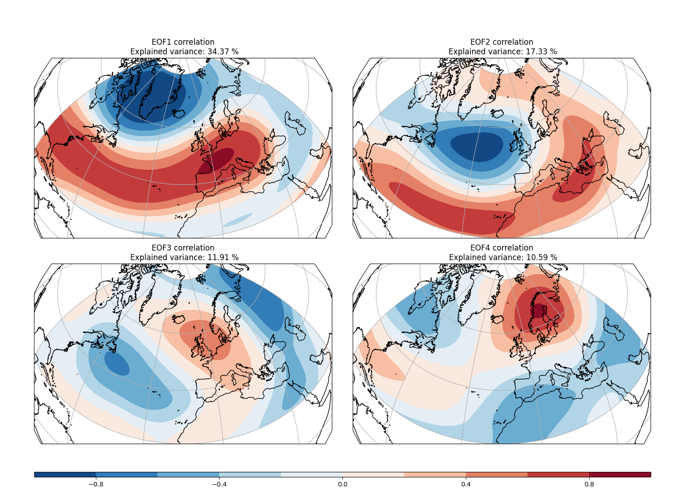

```{=html}
<div style="max-width:960px;margin:6rem auto;padding:0 1.5rem;">

  <h2 style="color:#003087;font-size:1.5rem;font-weight:700;margin-bottom:0.5rem;text-align:center;">
    Metodología de ponderación EOF + PLS
  </h2>
  <p style="color:#4a5568;margin-bottom:2rem;text-align:center;">
    Esquema del proceso, modos de variabilidad y cálculo de pesos del ensemble.
  </p>

  <!-- ============================================================ -->
  <!-- DIAGRAMA DE FLUJO (SVG)                                      -->
  <!-- ============================================================ -->
  <div class="wt-diagram-wrap">
    <svg viewBox="0 0 980 460" xmlns="http://www.w3.org/2000/svg"
         preserveAspectRatio="xMidYMid meet" class="wt-diagram">

      <defs>
        <marker id="wt-arrow" viewBox="0 0 10 10" refX="9" refY="5"
                markerWidth="7" markerHeight="7" orient="auto-start-reverse">
          <path d="M0,0 L10,5 L0,10 z" fill="#0A304A"/>
        </marker>
      </defs>

      <!-- FILA SUPERIOR · construcción de los modos -->
      <g class="wt-row-label">
        <text x="20" y="60" font-size="13" font-weight="700" fill="#0A304A"
              letter-spacing="1.5" text-transform="uppercase">CONSTRUCCIÓN DE MODOS</text>
      </g>

      <!-- Caja 1: ERA5 MSLP -->
      <g class="wt-box">
        <rect x="60"  y="90" width="220" height="80" rx="8"
              fill="#E6F1FA" stroke="#0A5EB8" stroke-width="2"/>
        <text x="170" y="120" text-anchor="middle" font-size="14" font-weight="700" fill="#0A304A">ERA5 MSLP</text>
        <text x="170" y="142" text-anchor="middle" font-size="12" fill="#0A304A">Climatología</text>
        <text x="170" y="158" text-anchor="middle" font-size="12" fill="#0A304A">1940–2021</text>
      </g>

      <!-- Flecha 1→2 -->
      <line x1="280" y1="130" x2="370" y2="130" stroke="#0A304A" stroke-width="2" marker-end="url(#wt-arrow)"/>

      <!-- Caja 2: Anomalías -->
      <g class="wt-box">
        <rect x="370" y="90" width="220" height="80" rx="8"
              fill="#E6F1FA" stroke="#0A5EB8" stroke-width="2"/>
        <text x="480" y="120" text-anchor="middle" font-size="14" font-weight="700" fill="#0A304A">Anomalías de MSLP</text>
        <text x="480" y="142" text-anchor="middle" font-size="12" fill="#0A304A">Agregadas en periodos</text>
        <text x="480" y="158" text-anchor="middle" font-size="12" fill="#0A304A">trimestrales</text>
      </g>

      <!-- Flecha 2→3 -->
      <line x1="590" y1="130" x2="680" y2="130" stroke="#0A304A" stroke-width="2" marker-end="url(#wt-arrow)"/>

      <!-- Caja 3: EOF/PLS -->
      <g class="wt-box">
        <rect x="680" y="90" width="240" height="80" rx="8"
              fill="#E6F1FA" stroke="#0A5EB8" stroke-width="2"/>
        <text x="800" y="118" text-anchor="middle" font-size="14" font-weight="700" fill="#0A304A">Descomposición EOF/PLS</text>
        <text x="800" y="138" text-anchor="middle" font-size="12" fill="#0A304A">Se retienen 4 EOFs/PLS y PCs</text>
        <text x="800" y="156" text-anchor="middle" font-size="12" fill="#0A304A">Modos de variabilidad</text>
      </g>

      <!-- Flecha vertical 3→6 -->
      <line x1="800" y1="170" x2="800" y2="290" stroke="#0A304A" stroke-width="2" marker-end="url(#wt-arrow)"/>

      <!-- FILA INFERIOR · aplicación al ensemble -->
      <g class="wt-row-label">
        <text x="20" y="270" font-size="13" font-weight="700" fill="#0A304A"
              letter-spacing="1.5" text-transform="uppercase">APLICACIÓN AL ENSEMBLE</text>
      </g>

      <!-- Caja 4: Ensemble -->
      <g class="wt-box">
        <rect x="60"  y="290" width="220" height="80" rx="8"
              fill="#E6F1FA" stroke="#0A5EB8" stroke-width="2"/>
        <text x="170" y="318" text-anchor="middle" font-size="14" font-weight="700" fill="#0A304A">Ensemble</text>
        <text x="170" y="338" text-anchor="middle" font-size="12" fill="#0A304A">Hindcast / Predicción</text>
        <text x="170" y="356" text-anchor="middle" font-size="12" fill="#0A304A">Anomalías de MSLP</text>
      </g>

      <!-- Flecha 4→5 -->
      <line x1="280" y1="330" x2="370" y2="330" stroke="#0A304A" stroke-width="2" marker-end="url(#wt-arrow)"/>

      <!-- Caja 5: Proyección -->
      <g class="wt-box">
        <rect x="370" y="290" width="220" height="80" rx="8"
              fill="#E6F1FA" stroke="#0A5EB8" stroke-width="2"/>
        <text x="480" y="318" text-anchor="middle" font-size="14" font-weight="700" fill="#0A304A">Proyección en EOF/PLS</text>
        <text x="480" y="340" text-anchor="middle" font-size="12" fill="#0A304A">ERA5 → PCs por miembro</text>
      </g>

      <!-- Flecha 5→6 -->
      <line x1="590" y1="330" x2="680" y2="330" stroke="#0A304A" stroke-width="2" marker-end="url(#wt-arrow)"/>

      <!-- Caja 6: Pesos -->
      <g class="wt-box">
        <rect x="680" y="290" width="240" height="80" rx="8"
              fill="#E6F1FA" stroke="#0A5EB8" stroke-width="2"/>
        <text x="800" y="318" text-anchor="middle" font-size="14" font-weight="700" fill="#0A304A">Cálculo de pesos</text>
        <text x="800" y="340" text-anchor="middle" font-size="12" fill="#0A304A">wᵢ(h) según distancia</text>
        <text x="800" y="356" text-anchor="middle" font-size="12" fill="#0A304A">en el espacio de PCs</text>
      </g>

      <!-- Texto explicativo final -->
      <text x="490" y="420" text-anchor="middle" font-size="13" fill="#0A304A" font-style="italic">
        Los modos EOF/PLS se derivan de ERA5; el ensemble se proyecta sobre esos modos
      </text>
      <text x="490" y="440" text-anchor="middle" font-size="13" fill="#0A304A" font-style="italic">
        y se pondera según la similitud con las PCs de la predicción objetivo.
      </text>
    </svg>
  </div>


  <!-- ============================================================ -->
  <!-- SECCIÓN 1 · MODOS DE VARIABILIDAD                            -->
  <!-- ============================================================ -->
  <h3 style="color:#003087;margin-top:3rem;font-size:1.2rem;font-weight:700;">
    1 · Modos de variabilidad: EOF o PLS
  </h3>

  <p style="color:#1a2332;line-height:1.55;margin-bottom:0.9rem;">
    Los patrones de circulación a gran escala del sector Euro-Atlántico modulan fuertemente la
    predictibilidad estacional sobre la Península Ibérica. Estos modos de variabilidad presentan a menudo
    una mayor capacidad predictiva que las propias variables objetivo (T2M, precipitación), lo que los convierte
    en una componente esencial de las estrategias de postproceso.
  </p>

  <p style="color:#1a2332;line-height:1.55;margin-bottom:0.6rem;">
    Se utilizan dos enfoques distintos para extraer estos modos:
  </p>

  <ul style="color:#1a2332;line-height:1.6;margin-bottom:1.5rem;padding-left:1.4rem;">
    <li style="margin-bottom:0.8rem;">
      <strong>Modos basados en EOF:</strong> calculados a partir de anomalías de MSLP de ERA5 sobre el sector
      Atlántico-Norte–Europa (90°W–60°E, 20°–85°N). Las cuatro primeras EOFs capturan los principales patrones
      de teleconexión euro-atlánticos — <strong>NAO, EA, EAWR y SCA</strong> — que influyen sobre la temperatura
      y precipitación en Iberia.
    </li>
    <li>
      <strong>Modos basados en PLS:</strong> teleconexiones dirigidas obtenidas mediante regresión <em>Partial
      Least Squares</em> (PLS). Las anomalías de MSLP actúan como predictores, mientras que las anomalías de
      temperatura (T2M) o precipitación (PR) sobre Iberia se utilizan como predictandos. Estos modos optimizan
      los patrones de circulación más relevantes para cada variable de superficie, mejorando el skill en
      temperatura durante la estación cálida (AMJ–ASO).
    </li>
  </ul>

  <!-- Figura: EOFs -->
  <figure class="wt-figure">
    
    <figcaption>
      Ejemplo: EOFs principales de las anomalías de MSLP de ERA5 en invierno (DJF), utilizados como
      modos de variabilidad para la ponderación del ensemble.
    </figcaption>
  </figure>

  <!-- Referencia preprint -->
  <div class="wt-ref-card">
    <span class="wt-ref-tag">Referencia metodológica</span>
    <p>
      La metodología PLS y su aplicación a la ponderación estacional de ensemble se describen en detalle en
      <a href="https://egusphere.copernicus.org/preprints/2025/egusphere-2025-3664/" target="_blank"
         rel="noopener">
        <em>«Targeted Teleconnections and their Application to the Postprocessing of Climate Predictions»</em>
      </a>
      de Clementine Dalelane (2025).
    </p>
  </div>


  <!-- ============================================================ -->
  <!-- SECCIÓN 2 · PONDERACIÓN DE MIEMBROS                          -->
  <!-- ============================================================ -->
  <h3 style="color:#003087;margin-top:2.5rem;font-size:1.2rem;font-weight:700;">
    2 · Ponderación de miembros del ensemble
  </h3>

  <p style="color:#1a2332;line-height:1.55;margin-bottom:0.9rem;">
    La ponderación del ensemble asigna mayor peso a aquellos miembros cuya fase de circulación
    (proyección sobre los modos EOF o PLS) es más cercana a la observada o predicha. Este marco generaliza
    el submuestreo (ponderación 0/1) y mejora la consistencia dinámica, especialmente para los patrones
    invernales relacionados con la NAO.
  </p>

  <p style="color:#1a2332;line-height:1.55;margin-bottom:0.6rem;">
    La mejora alcanzable mediante la ponderación depende de dos factores:
  </p>

  <ul style="color:#1a2332;line-height:1.6;margin-bottom:1.2rem;padding-left:1.4rem;">
    <li style="margin-bottom:0.5rem;">
      Cuánta varianza de la variable objetivo (T2M, PR) está explicada por los modos.
    </li>
    <li>
      Con qué precisión pueden predecirse los propios modos.
    </li>
  </ul>

  <p style="color:#1a2332;line-height:1.55;margin-bottom:2.5rem;">
    La ponderación basada en EOF mejora las predicciones de T2M y PR en invierno y comienzos de primavera,
    mientras que los modos basados en PLS aportan valor añadido para las predicciones de temperatura en la
    estación cálida. La precipitación se beneficia menos en verano debido a su carácter convectivo y de
    escala local.
  </p>


  <!-- ============================================================ -->
  <!-- NAVEGACIÓN INFERIOR                                          -->
  <!-- ============================================================ -->
  <div class="wt-nav">
    <a href="weighting-resultados.html" class="wt-nav-next">
      Ver resultados →
    </a>
  </div>

</div>


<!-- ============================================================ -->
<!-- ESTILOS                                                       -->
<!-- ============================================================ -->
<style>
/* ── Diagrama SVG ──────────────────────────────────────── */
.wt-diagram-wrap {
  background: white;
  border: 1px solid #dde3ed;
  border-radius: 10px;
  padding: 1.5rem 1rem;
  margin-bottom: 2.5rem;
  box-shadow: 0 2px 12px rgba(0,48,135,0.06);
  overflow-x: auto;
}
.wt-diagram {
  width: 100%;
  height: auto;
  min-width: 720px;
  display: block;
}

/* ── Figura ────────────────────────────────────────────── */
.wt-figure {
  margin: 1.5rem 0 2rem 0;
  text-align: center;
}
.wt-figure img {
  max-width: 85%;
  height: auto;
  border-radius: 8px;
  box-shadow: 0 2px 12px rgba(0,0,0,0.12);
  display: inline-block;
}
.wt-figure figcaption {
  font-size: 0.85rem;
  font-style: italic;
  color: #4a5568;
  margin-top: 0.8rem;
  max-width: 720px;
  margin-left: auto;
  margin-right: auto;
  line-height: 1.4;
}

/* ── Tarjeta de referencia ─────────────────────────────── */
.wt-ref-card {
  background: #f4f8fd;
  border-left: 4px solid #003087;
  border-radius: 6px;
  padding: 1rem 1.3rem;
  margin: 2rem 0;
}
.wt-ref-tag {
  display: block;
  font-size: 0.7rem;
  font-weight: 700;
  letter-spacing: 0.12em;
  text-transform: uppercase;
  color: #003087;
  margin-bottom: 0.4rem;
}
.wt-ref-card p {
  margin: 0;
  font-size: 0.92rem;
  line-height: 1.55;
  color: #1a2332;
}
.wt-ref-card a {
  color: #0072bc;
  text-decoration: none;
  border-bottom: 1px solid rgba(0,114,188,0.3);
}
.wt-ref-card a:hover {
  border-bottom-color: #0072bc;
}

/* ── Navegación inferior ───────────────────────────────── */
.wt-nav {
  display: flex;
  justify-content: flex-end;
  margin: 2.5rem 0 1rem 0;
  padding-top: 1.5rem;
  border-top: 1px solid #e8eef5;
}
.wt-nav-next {
  padding: 0.6rem 1.4rem;
  background: #003087;
  color: white;
  border-radius: 6px;
  text-decoration: none;
  font-size: 0.88rem;
  font-weight: 600;
  letter-spacing: 0.03em;
  transition: background 0.15s;
}
.wt-nav-next:hover {
  background: #0072bc;
  color: white;
}

/* ── Responsive ────────────────────────────────────────── */
@media (max-width: 768px) {
  .wt-figure img { max-width: 100%; }
}
</style>
```
